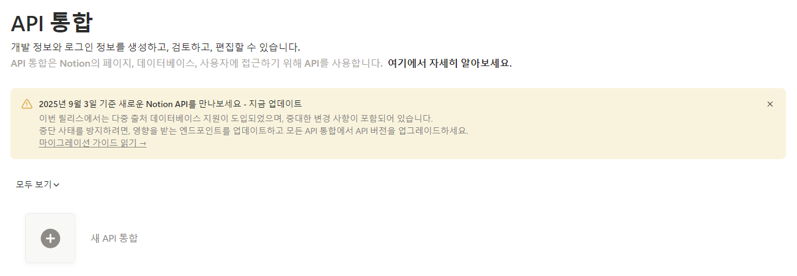
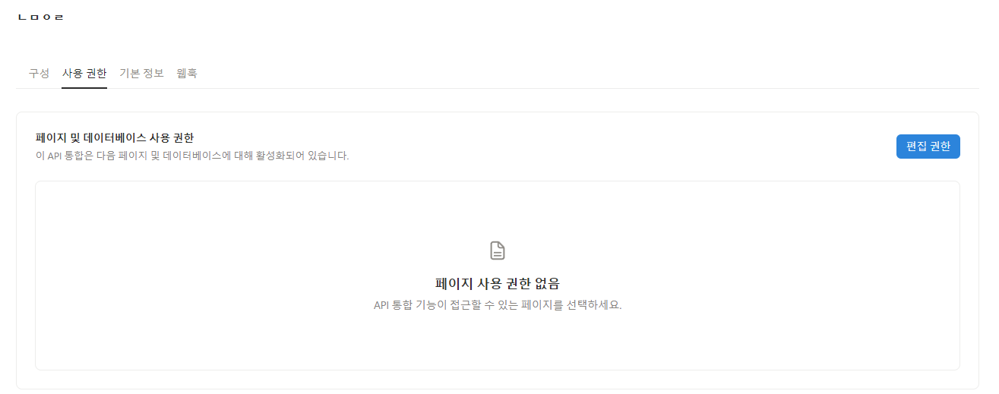

# Paper Summary AI Agent

논문 PDF를 넣으면:
1) AI agent 기반의 논문 요약 
2) 논문의 피겨를 포함 하여 배치 


## 1) 요구사항
- Python 3.10+
- Notion 계정 (데이터베이스 + 내부 통합)
- OpenAI API 키

---

## 2) 설치

```bash
git clone https://github.com/Kwak-DongKyu/ingest-paper-kor-.git
```
- 터미널에서 설치된 폴더로 이동

```bash
# (권장) 가상환경
python -m venv .venv

# macOS/Linux 일 경우
source .venv/bin/activate
# Windows PowerShell 일 경우
.venv\Scripts\Activate.ps1

# 필수 패키지들 다운로드 
pip install -r requirements.txt
```


### Notion API 찾는 법 

https://www.notion.so/profile/integrations



이후 API 와 내 페이지 내의 데이터베이스와 연동 시켜야 함. 




## Demo
- 입력: `paper_pdf/` 폴더 안의 PDF들
- 출력: Notion DB의 새 페이지(상단: 논문 URL → PDF → Figure 1 → 섹션/피겨 섞기)

---