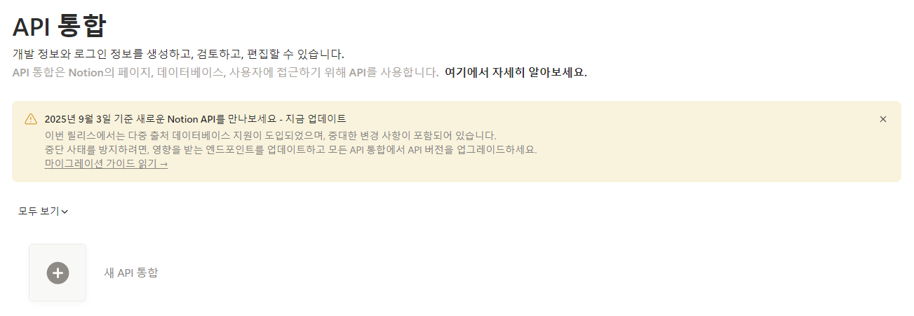
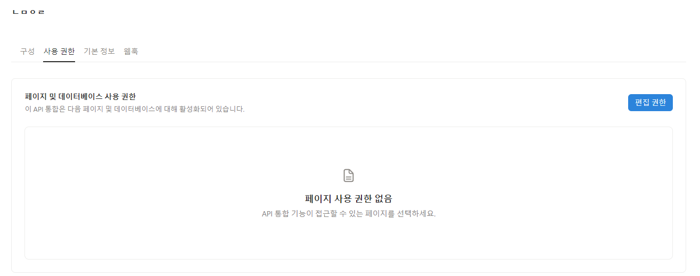
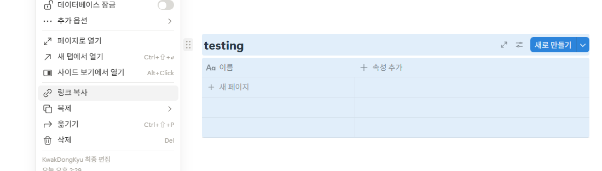

# Paper Summary AI Agent

논문 PDF를 넣으면:
1) AI agent 기반의 논문 요약 
2) 논문의 피겨를 포함 하여 배치 


## 1) 요구사항
- Python 3.10+
- Notion 계정 (데이터베이스 + 내부 통합)
- OpenAI API 키

---

## 2) 설치

```bash
git clone https://github.com/Kwak-DongKyu/ingest-paper-kor-.git
```
- 터미널에서 설치된 폴더로 이동

```bash
# (권장) 가상환경
python -m venv .venv

# macOS/Linux 일 경우
source .venv/bin/activate
# Windows PowerShell 일 경우
.venv\Scripts\Activate.ps1

# 필수 패키지들 다운로드 
pip install -r requirements.txt
```


## 3) Notion API 찾는 법 
.env 파일의 아래 두 가지 항목을 채워야 함. 
3.1 NOTION_TOKEN
3.2 NOTION_DATABASE_ID


**3.1 (NOTION_TOKEN) 아래 사이트에서 API 키 발급 및 데이터베이스를 수정할 권한을 부여해야 함.** 
https://www.notion.so/profile/integrations

- 새 API 통합 버튼 클릭
- 이후 생성된 API 키를 .env 파일의 NOTION_TOKEN 에 입력


**이후 API 와 내 페이지 내의 데이터베이스와 연동 시켜야 함.** 
- 생성 API 클릭 -> 사용 권한 -> 편집 권한 부여
(내 데이터베이스가 있는 노션 페이지를 설정하면 됨)


**3.2 (NOTION_DATABASES_ID) 위 연동해둔 페이지 내에 데이터베이스(표) 를 만들고 링크를 .env-NOTION_DATABASE_ID 항목에 입력** 


데이터베이스 링크 복사 시 형태는 https://www.notion.so/1111111111111?v=222222222&source=copy_link 형태이며 1111 부분만 복제하여
.env 파일의 NOTION_DATABASE_ID 항목에 입력


## 4) GPT API 발급 방법

- 아래 사이트에서 새로 생성 후 결제 수단 등록 및 일정 금액 충전되어야 함.
https://platform.openai.com/api-keys


## 5) Demo
- 입력: `paper/` 폴더 안에 분석할 PDF를 삽입
- 터미널에서 아래 ingest_paper.py 실행

```bash
python ingest_paper.py
```

---

### 5.1 예시 
현재 첨부되어 있는 pdf(wrimoucon)을 넣었을 때 


## 6) 커스터마이징
ingest_paper.py 파일 내의 call_gpt_contents 내의 프롬프트를 변경함으로써 원하는 내용 생성으로 변경 가능. 